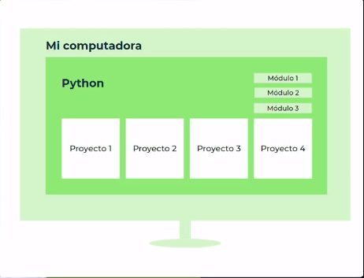
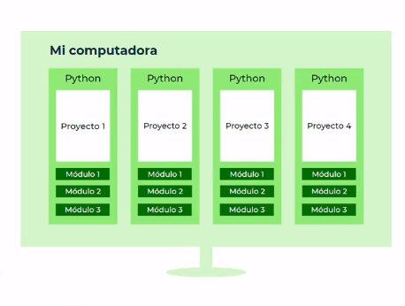

# 6_Curso_de_Python_Intermedio_Comprehensions_Lambdas_y_Manejo_de_Errores

**Curso intermedio de Python**

**List**

- [El Zen de Python](#el-zen-de-python)
- [¿Qué es la Documentación?](#¿qué-es-la-documentación)

# El Zen de Python 

El Zen de Python se compone por los principios para escribir tu código de manera clara, sencilla y precisa. Estos son:

* **Bello es mejor que feo:**
Pyhton es estéticamente superior a cualquier otro lenguaje de programación. Al momento de escribir código, es mejor que sea de manera limpia y estética.
* **Explícito es mejor que implícito:**
Hacer más fácil que las otras personas entiendan el código.
* **Simple es mejor que complejo:**
Es mejor tener una implementación simple, que ocupe pocas lineas de código y sea entendible, a que sea una larga y complicada.
* **Complejo es mejor que complicado:**
Si tenemos que extendernos en la implementación y hacerla más compleja para que el código si se entienda, esto es mejor que hacerlo simple y mal.
* **Plano es mejor que anidado:**
El anidamiento es cuando tenemos un bloque de código dentro de otro bloque de código (dependiendo de este). Esto se nota en Python por la identación, nos quedarían estos bloques muy corridos a la derecha.
Es mejor evitar el anidamiento, y hacer las cosas de manera plana.
* **Espaciado es mejor que denso:**
Por la identación de Python (sus sangrías), este principio se nos hace imposible de esquivar. El código inevitablemente es espaciado.
* **La legibilidad es importante:**
Es importante que otros programadores puedan entender lo que estamos escribiendo. Esto hace más fáciles las cosas cuando trabajemos con otros en los proyectos.
* **Los casos especiales no son lo suficientemente especiales cpmo para romper las reglas (sin embargo, la practicidad le gana a la pureza):**
Siempre que podamos respetar estas reglas que nos plantea Python, es mejor así. Sin embargo, si por el hecho de hacer un código muy puro o muy ‘Pythonista’, este pierde legibilidad, es mejor ser más prácticos y romper o saltearnos algunas de estas reglas para que el código sea más eficiente. Por lo tanto, llegado el momento debermos decidir si es mejor hacer las cosas de manera pura o práctica.
* **Los errores nunca deberían pasar silenciosamente (a menos que se silencien explícitamente):**
Manejar los erroes es fundamental. Cada error nos dice algo y hay que prestarle atención. A menos que seas capaz de silenciar un error explícitamente, aunque para esto hay que tener criterio.
* **Frente a la ambiguedad, evitar la tentación de adivinar:**
Nuestro código debería solamente tener una interpretación. Si en un contexto significa algo, y en otro otra cosa, es mejor que lo revisemos y busquemos una solución.
* **Debería haber una, y preferiblemente sola, una manera obvia de hacerlo. (A pesar de que esa manera no sea obvia a menos que seas holandés):**
Esto hace referencia al creador de Python ''Guido van Rossum", que de manera muy inteligente encontrar las soluciones precisas a los problemas, y deberíamos imitarlo.
* **Ahora es mejor que nunca:**
Es mejor desarrollar nuestra solución cuánto antes, no dejarlo para mañana o para mas adelante.
* **A pesar de que nunca es muchas veces mejor que ahora mismo:**
Si por hacer las cosas ya y tenemos poco tiempo, si es mejor dejarlo para después y no hacerlo apurado y mal.
* **Si la implementación es díficil de explicar, es una mala idea, y si es fácil de explicar, es una buena idea:**
Si somos capaces de explicar nuestra implementación a otros desarrolladores paso a paso, es una buena idea. En cambio si no podemos hacerlo, significa que ni nosotros entendemos la implementación y deberíamos repensar nuestra forma de encarar la solución.
* **Los espacios de nombres son una gran idea, ¡Tengamos más de esos! (namespaces):**
Es el nombre que se ha indicado luego de la palabra import, es decir la ruta (namespace) del módulo. (Lo veremos a profundidad más adelante).

# ¿Qué es la Documentación? 

**La documentación es la biblia de cualquier programador.**

No puedes aspirar a aprender un lenguaje si no lees documentación. Sé que muchas personas se saltan eso porque piensan “ufff, es mucho texto, se ve feo”, etc. Pero es la documentación quien nos va a decir exactamente cómo funciona el lenguaje (y cualquier tecnología). No hay un solo desarrollador profesional que no lea documentación.

¡Y claro!, con esto no quiero decir que tengas que estar metido en la documentación siempre, pero quiero que sepas que la vas a consultar muchas veces cuando tengas problemas ❤️.

En ese paso de programador novato a programador profesional se encuentra aprender a consultar documentación, da el paso, no le temas a la documentación, es tu mejor amiga 😄.

[Documentación-Python](https://platzi.com/clases/2255-python-intermedio/36457-que-es-la-documentacion/)

# ¿Qué es un Entorno Virtual? 

* **Módulo**: Es código escrito por otra persona que sirve para resolver un problema de manera rápida. 

Se debería tener una versión única de Python funcionando en cada proyecto, por lo tanto, al actualizar los módulos se puede elegir en que proyecto actualizarlo y en cuál no. 

El concepto de entorno virtual se reduce a tener python funcionando independientemente a cada proyecto. 

la idea es sencilla, de hecho el concepto es similar al de los contenedores de Docker, como profesional empezarás a requerir de trabajar diversos proyectos que trabajen con diferentes versiones, ya sea del lenguaje o de algún módulo.

Sería una catástrofe tener que instalar y actualizar módulos para cada proyecto cuidando que ninguno se rompa, porque fácilmente podrías actualizar un módulo que, para un proyecto funcione, pero para otro deje de funcionar, es por eso que se crea el concepto de entornos virtuales.

Este concepto lo tienen muchos lenguajes, y lo genial es que soluciona muy bien el problema de la compatibilidad entre proyectos, porque cada entorno virtual es independiente y funciona con las versiones que se les hayan instalado ahí mismo.

